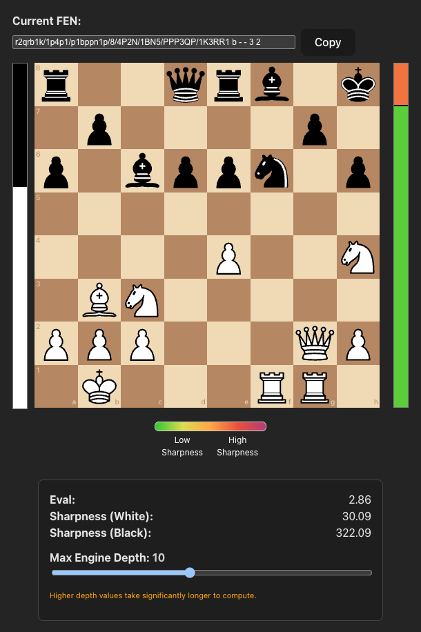

# Sharpness Eval Chess

A minimalist chess evaluation app that analyzes positions using Stockfish and displays two key metrics:

* **Evaluation (Eval)**: The traditional engine score in pawns.
* **Sharpness**: A custom metric representing how difficult a position is to play.

Experienced chess players are able to identify "sharp" positions versus calm ones after studying a given position, and can even identify whether white or black has 
the easier position to play. However, there haven't been many attempts to measure or quantify Sharpness. This project intends to calculate sharpness systematically.

The traditional evaluation bar is displayed on the left side of the board, while the Sharpness bar appears on the right. The colors reflect the absolute sharpness 
of each position, and the divider within the bar represents the relative sharpness between White and Black.

<p align="center">
  
</p>

---

## ⚔️ What Is Sharpness?

**Sharpness** is a term intended to describe the *difficulty* of a position. In some ways, it can serve as a proxy estimate for how much time a player might spend 
before making a move in a given position. 

Here, it's based on three core components:

1. **Scarcity of Good Moves**: How many legal moves are actually good? If only 1 out of 30 is good, it's sharp. In other words, "How wide is the path to victory?"
2. **Depth of Recognition**: How deep Stockfish (our engine) must go to discover whether a move is good or bad. Or "How easily can we *find* the path to victory?"
3. **Cost of Failure**: The drop-off in evaluation between a good move and the best bad move. "If we fall off the path, are we landing on concrete or lava?"

The formula (simplified) is:

```
Sharpness = (1 / % good moves) * avg_depth * punishment_factor
```

Values are capped at **500** for interpretability. A sharpness of 100+ usually indicates a tricky tactical position.

---

## 🔄 What Is Depth?

**Depth** is how many plies (half-moves) ahead Stockfish analyzes. Higher depth yields more accurate scores and sharper distinction between good and bad moves.

* **Low depth (4-8)** is fast but coarse.
* **High depth (14-18)** is slow but precise.

You can control the max depth with a slider in the UI.

---

## 📂 What Is FEN?

**FEN (Forsyth-Edwards Notation)** is a standard format to describe a chess position. It looks like this:

```
r2qrb1k/1p4p1/p1bppn1p/8/4P3/1BN2N2/PPP3QP/1K3RR1 w - - 2 2
```

This contains:

* Piece positions
* Side to move ("w" = White, "b" = Black)
* Castling rights
* En passant targets
* Halfmove clock
* Fullmove number

You can paste any FEN into the app to analyze a position.

---

## 🔹 Example Positions

### Example 1: Tactical Minefield

```
r2qrb1k/1p4p1/p1bppn1p/8/4P3/1BN2N2/PPP3QP/1K3RR1 w - - 2 2
```

* **Eval**: +2.51
* **Sharpness**: White 30.09, Black 103.01
* Interpretation: Black has more ways to go wrong. Even though White is winning, Black's defense is difficult.

### Example 2: Calm Advantage

```
2rq1rk1/pp3ppp/1bnp1n2/8/3P4/2N1PN2/PP3PPP/R1BQR1K1 w - - 0 10
```

* **Eval**: +0.83
* **Sharpness**: White 12.7, Black 14.3
* Interpretation: Slight edge for White, but very playable for both sides.

---

## 💡 Built With

* [React](https://react.dev/)
* [react-chessboard](https://github.com/Clariity/react-chessboard)
* [FastAPI](https://fastapi.tiangolo.com/)
* [python-chess](https://python-chess.readthedocs.io/en/latest/)
* [Stockfish](https://stockfishchess.org/)

